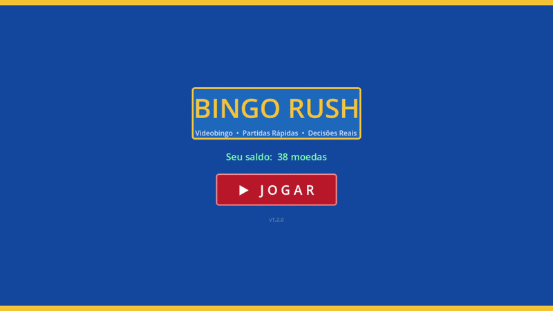
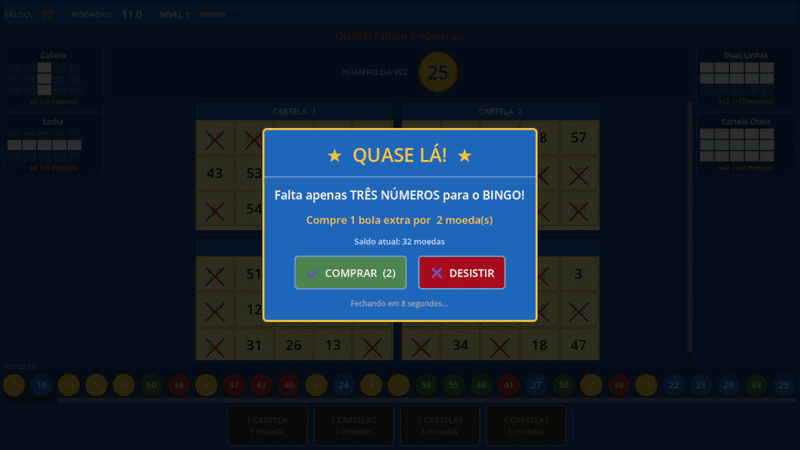

<div align="center">

# 🎱 Bingo Rush

**Videobingo arcade rápido e viciante — sorteio progressivo, near-win e bola extra num clique.**

[](https://godotengine.org)
[](https://docs.godotengine.org/en/stable/tutorials/scripting/gdscript/)
[](LICENSE)
[](config/game_config.json)
[](https://github.com/Nelson-D3v/bingo-rush/releases)

[📥 Download](https://github.com/Nelson-D3v/bingo-rush/releases) · [Reportar bug](https://github.com/Nelson-D3v/bingo-rush/issues) · [Solicitar feature](https://github.com/Nelson-D3v/bingo-rush/issues)



</div>

---

## ✨ Por que Bingo Rush?

> Bingo clássico exige sala cheia, cartelas de papel e sorteador humano. Bingo Rush elimina tudo isso e entrega a adrenalina do near-win na palma da mão.

A maioria dos videobingos exige configuração complexa, depende de servidor ou trava em resoluções fixas. **Bingo Rush** roda offline, em qualquer tela, com economia e progressão 100% configuráveis por JSON — sem tocar em código.

**Para quem é:** jogadores casuais que querem partidas rápidas de 30 s, e devs que querem estudar um loop de jogo arcade bem estruturado em Godot 4.

---

## ⚡ Quick Start

**Pré-requisitos:** Godot 4.x (testado em 4.6 GL Compatibility)

```bash
# Clone o repositório
git clone https://github.com/Nelson-D3v/bingo-rush.git

# Abra no Godot
# File → Open Project → selecione a pasta bingo-rush/
# Pressione F5 para rodar
```

Nenhuma dependência externa, nenhum passo extra. O jogo inicia direto na tela de título.

> 💡 **Prefere jogar sem compilar?** Baixe a build já exportada em [Releases](https://github.com/Nelson-D3v/bingo-rush/releases).

---

## 🎯 Features

- 🎱 **Cartelas 3×5** — 15 números únicos por cartela, pool sem repetição entre até 4 cartelas simultâneas
- 🔄 **Troca gratuita** — clique em qualquer cartela antes de confirmar para gerar uma nova, sem custar moedas
- ⚡ **Sorteio progressivo** — velocidade aumenta de 0,30 s → 0,12 s conforme os números saem; modo Turbo a 0,07 s
- 🎯 **Near-win inteligente** — detecta 1, 2 ou 3 números faltando e oferece bola extra com preço dinâmico
- 🏆 **4 padrões de vitória** — Coluna (×2), Linha (×4), Duas Linhas (×12), Cartela Cheia (×40)
- 🎲 **Eventos aleatórios** — Bola Bônus grátis (5 %), Multiplicador ×1,5/×2/×3 (4 %), Rodada Turbo (8 %)
- 📈 **Progressão persistente** — XP, nível, moedas e sequência de vitórias salvos em `user://`
- ⚙️ **100 % configurável** — economia, padrões, intervalos e probabilidades no `config/game_config.json`

---

## 🕹️ Como jogar



1. Escolha de **1 a 4 cartelas** — cada cartela custa 1 moeda (cobrado só ao confirmar)
2. **Troque cartelas** à vontade clicando nelas — é grátis enquanto o jogo não começou
3. Clique em **INICIAR BINGO** — as moedas são descontadas e o sorteio começa
4. Os números são **marcados automaticamente** nas suas cartelas
5. Ao detectar near-win, um popup oferece **bola extra** com countdown de 10 s
6. Complete um padrão e **ganhe moedas**; a rodada termina em segundos

---

## 📖 Arquitetura

```
bingo-rush/
├── autoloads/
│   ├── GameEvents.gd       # Signal bus global (desacopla todos os sistemas)
│   ├── ConfigLoader.gd     # Lê game_config.json com dot-path access
│   └── SaveManager.gd      # Salva/carrega progresso do jogador
├── scripts/
│   ├── GameManager.gd      # Máquina de estados principal
│   ├── CardManager.gd      # Geração e troca de cartelas (pool único)
│   ├── DrawManager.gd      # Sorteio progressivo com modo turbo
│   ├── PatternChecker.gd   # Verificação de padrões e near-wins
│   ├── RewardManager.gd    # Cálculo de recompensas e eventos
│   └── ExtraBallSystem.gd  # Precificação dinâmica da bola extra
├── scenes/
│   ├── GameScreen.gd       # Tela principal (seleção + jogo)
│   └── components/
│       └── BingoCard.gd    # Cartela visual com animações
└── config/
    └── game_config.json    # Toda a economia e regras do jogo
```

**Fluxo de estados:**

```
IDLE → CARD_SELECTION → DRAWING → CHECKING_WIN → EXTRA_BALL_OFFER → REWARDING → IDLE
```

---

## ⚙️ Configuração

Edite `config/game_config.json` sem abrir o Godot:

```json
{
  "economy": {
    "card_cost": 1,
    "starting_coins": 100,
    "rtp_target": 0.68
  },
  "draw": {
    "total_numbers": 60,
    "numbers_per_round": 30,
    "draw_interval_start": 0.30,
    "draw_interval_end": 0.12,
    "turbo_interval_seconds": 0.07
  },
  "events": {
    "bonus_ball_chance": 0.05,
    "multiplier_chance": 0.04,
    "turbo_round_chance": 0.08
  }
}
```

Padrões de vitória também são definidos no JSON — adicione novos padrões com células personalizadas sem mexer em código.

---

## 🛠️ Desenvolvimento local

```bash
git clone https://github.com/Nelson-D3v/bingo-rush.git
cd bingo-rush

# Abra no Godot 4 e pressione F5
# Ou rode headless para testes:
godot --headless --quit
```

Para exportar:

```
Project → Export → selecione a plataforma → Export Project
```

---

## 📊 Padrões de vitória

| Padrão | Células | Multiplicador | Dificuldade |
|---|---|:---:|---|
| Coluna | 3 células (1 coluna completa) | ×2 | ⭐ |
| Linha | 5 células (1 linha completa) | ×4 | ⭐⭐ |
| Duas Linhas | 10 células (2 linhas completas) | ×12 | ⭐⭐⭐⭐⭐ |
| Cartela Cheia | 15 células (cartela inteira) | ×40 | ⭐×10 |

---

## 🤝 Contribuindo

Contribuições são bem-vindas! Leia o [CONTRIBUTING.md](CONTRIBUTING.md) para entender o processo.

1. Fork o projeto
2. Crie sua branch (`git checkout -b feature/novo-padrao`)
3. Commit suas mudanças (`git commit -m 'feat: adiciona padrão diagonal'`)
4. Push para a branch (`git push origin feature/novo-padrao`)
5. Abra um Pull Request

**Ideias de contribuição:** novos padrões de vitória, temas visuais, modo multiplayer local, leaderboard.

---

## 📝 Changelog

Veja [CHANGELOG.md](CHANGELOG.md) para histórico completo.

- **v1.2.0** — Layout adaptativo 1-4 cartelas, miniaturas de padrão corrigidas, fallback de configuração
- **v1.1.0** — Sistema de troca gratuita pré-jogo, near-win com bola extra
- **v1.0.0** — Release inicial

---

## 📄 Licença

Distribuído sob a licença MIT. Veja [LICENSE](LICENSE) para mais informações.

---

<div align="center">

Se curtiu o projeto, considera dar uma ⭐ — faz diferença!

Feito com ❤️ por [Nelson Felix](https://github.com/Nelson-D3v)

</div>
